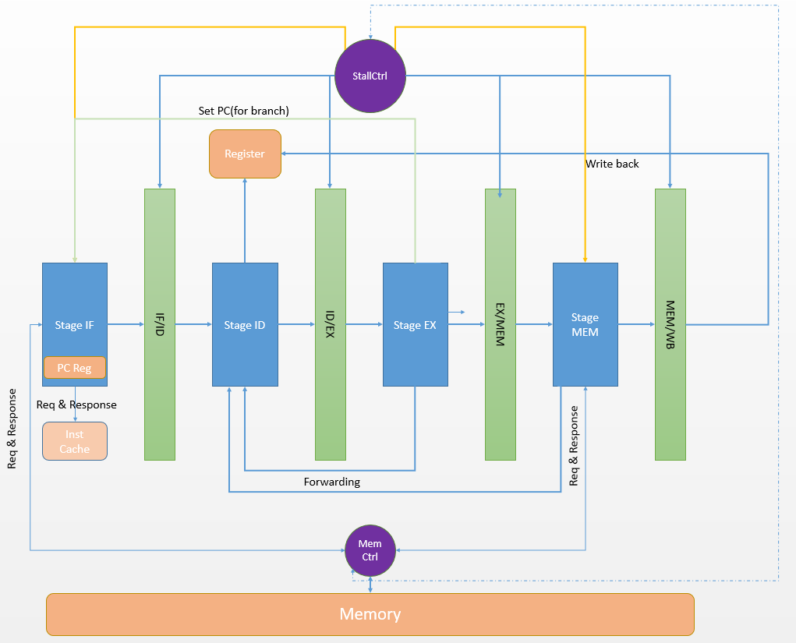
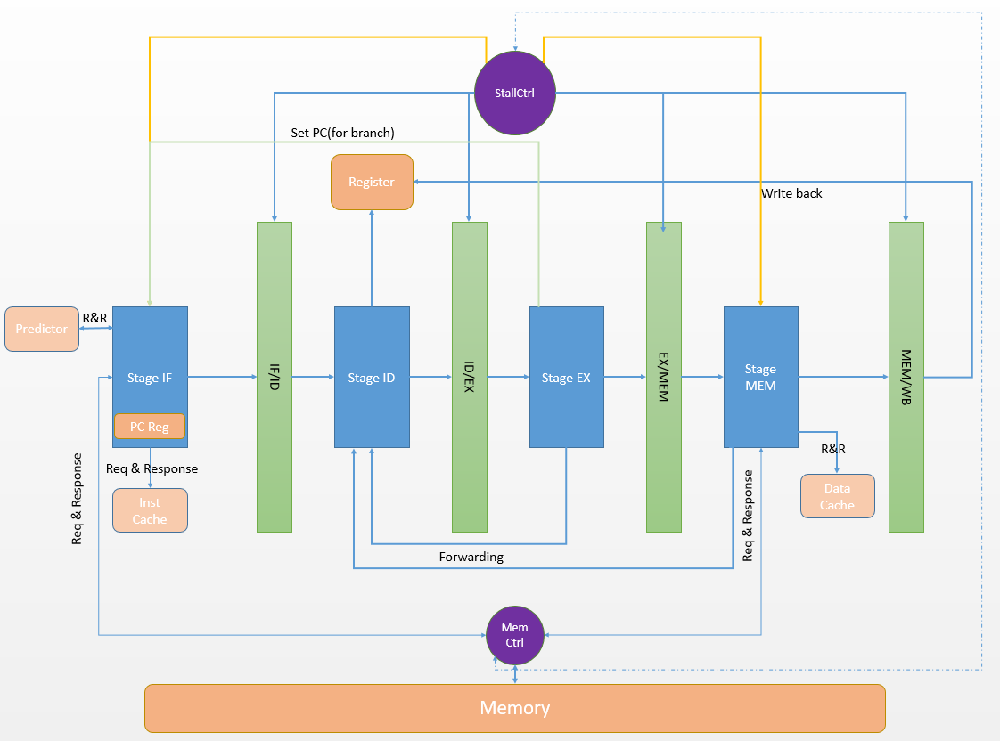

# RISC-V CPU 报告文档

## 1、简介

​		本次大作业实现了一个近似标准的五级流水CPU，支持rv32i指令集，共有三个主要版本。

- 五周期取指令流水版本（Simulation Passed, FPGA failed）

  256 * 32bit inst cache with DM

- 六周期取指令流水版本（可超频至200mhz，pi的时间在1.0s左右）

  no predictor: 256 * 32bit inst cache with DM, pi的时间在1.0s左右

  with predictor: 256 * 32bit inst cache with DM, pi的时间在0.8s左右

- 六周期取指令流水版本（50mhz ok）

  127 * 32 * 2bit 2-way associative inst cache with FIFO

  128 * 32bit data cache with DM

  64 * 4bit (2,2) correlating BHT predictor

## 2、架构示意图

 

## 3、与教科书标准五级流水的异同

### 同

- 均为五级流水，其中IF阶段取指，ID解码，EX算数运算，MEM内存读写，WB写回寄存器
- 均有完整Data Forwarding，因而除前一条为Load指令的RAW外无Datahazard(需要stallcontroll判断)
- Register有两个读端口和一个写端口，因而没有ID和WB的Structral hazard

### 异

- 说明：与教科书五级流水的不同之处主要由于以下原因:
  - Memory单端口的限制,我们的Memory是单端口Memory，因而IF和MEM之间存在Structural Hazard，需要特殊的处理
  - Memory数据线只有8bit，这意味着取一个32bit数据需要4个周期，于是IF和MEM在进行Memory访问是多周期的，逻辑较为复杂
- PCReg集成在了IF中，由于取指要发4个周期的地址，PCReg集成在内逻辑更简单些
- inst-cache和data-cache并不是拦在IF/MEM和Memory之间，为了使cache miss的逻辑更为清晰，并且同步对Memory取数据和对cache的访问可以减少周期数

## 4、细节实现

- 内存读写

  在IF和MEM中采用状态机的写法，用时序逻辑实现了一个类似内存读写上的“小”流水的结构

  MEM的优先级比IF高，当MEM进行读写请求时，IF被立刻stall

  - 读：通过在一周期内即收数据又发新地址的操作实现六周期取32bit
    - 关于五周期取指的想法来自郭林松同学，在IF阶段可以在上一条指令的第六个周期（收byte4）时进行下一条指令的请求，这样就使两条指令的取指重叠了一个周期，相当于成为了五周期取指。我也实现了这一想法，但是只能通过simulation测试而无法上板，时间所限也没有调试出来。
  - 写：MEM的写操作采用类似做法，5个周期即可停止占用，

- 分支指令

  - 无predictor的版本，静态默认不跳转，在EX阶段发现应当jump时会发送flush信号将在IF/ID，ID/EX寄存器中的数据销毁，同时向IF发送新的地址，让IF重新取正确的指令
  - 有predictor的版本，IF会对branch指令特殊判断，发现是branch指令后向predictor模块询问一个地址（加法在predictor模块中做)，下周期收到预测结果开始取指。 若预测错误则仍会在EX阶段发现并产生flush信号消除影响。

- i-cache和d-cache(DM)

  - 256行，8位index，8位tag（18-2-8），2位offset（i-cache不需要）
  - 收到请求后比较tag判断hit，对于IF，hit则可以开始下一次请求，对于MEM，hit则可以结束MEM，停止stall

- i-cache(FIFO)

  - 128行*2，7位index，9位tag（18-2-7），2-way associative

  - 对于这里的FIFO实现，使用了一个特别的的标记位（0or1）。由于initial语句以及循环语句不能综合，所以对于整个cache的置零是无法做到的，这样一般的判断某一路为空就往里赋值无法实现，所以使用这个标记位。

    标记位为0时表示上一次对该行进行缓存时写在了1这一路，这一次应当写在0这一路

    标记位为1时反过来，标记位为其他情况（高阻态等初始情况时）向0这一路写，并将标记更改为1

## 5、遇到的问题

#### IF和MEM的Structral Hazard

- 一开始我写的第一个版本是在发现memctrl在被人占用时等待memctrl做好，再进行自己的读写操作。后来在MEM占用后让IF重新开始占用memctrl的问题上产生了巨大的问题，进行了多种尝试未果后发现了现在这种架构，觉得逻辑更为清晰合理，于是进行了改写。

#### 唯一可能的RAW hazard

- 写出i-cache后的由于连续hit会产生RAW问题，在一些测例上可以跑过，一些测例上跑不过，进行了多种尝试。原先是在指令过ID/EX时判断是否为load指令，是load则stall流水线，并让MEM阶段判断load结束stall状态，是一个可行方案，但是速度感人。后改为将EX的rd和ID的reg访问进行判断，将ID阶段stall一个周期，解决了这个问题。

#### 上板是玄学

- 本次CPU大作业产生三个版本实在是无奈之举。

  在六周期取指的版本上我可以进行200mhz的超频，偶尔能有pi 0.98s的测试时间，大部分时候都在1.0x s徘徊。为了稳定的进1s在郭林松同学的指引下我完成了五周期取指的改写，但是simulation可过而无法上板令人难受至极（尝试降频无效）。

  d-cache的版本也是如此，经过多次尝试，2-way i-cache+ DM d-cache+（2，2）BHT predictor的版本只能在50mhz的情况下上板。

  最后阶段的调试心态爆炸，也没有时间，就只能这样了。
  
  #### 关于调试方法

+ 在进行CPU的调试过程中一直都陷入矛盾，肉眼看波形图极度困难，后来在数理逻辑的学习中获得了灵感

  在RegisterMachine的章节里我们知道程序运行状态可以由寄存器状态大致看出，于是得到输出所有对寄存器的更改的调试方法

  即在regfile的写端口写下 ``` $display("write at ", reg_addr, "  ", wdata)```

  然后通过与保证正确性的旧版本输出对比达到快速定位错误的效果

## 6、参考资料与致谢

[1] 自己动手写CPU,雷思磊,电子工业出版社,2014

[2] 17届多位学长学姐的Github仓库


特别感谢郭林松同学在5周期fetch以及RAW datahazard方面给我提供的帮助

特别助教们在上板，超频等多方面的倾力帮助
